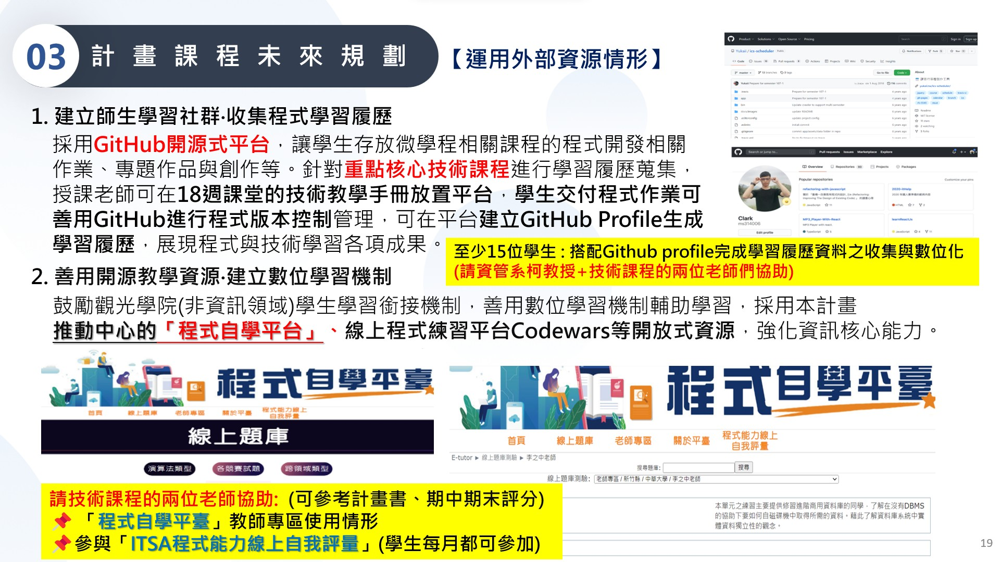

# 112教育部智慧創新計畫
<a href="http://140.126.146.12:9090/GitHub2023/">112教育部智慧創新之GitHub學習平台</a>&nbsp;<a href="https://chat.openai.com/auth/login">技術諮詢</a>
<table>
  <tr>
    <th>系級</th>
    <th></th>
    <th><a href="">學習履歷</a></th>
    <th><a href="https://chat.openai.com/">好友</a></th>
  </tr>
  <tr>
    <td><a href="https://lm.chu.edu.tw/index.php?Lang=zh-tw">休閒</a></td>
    <td><a href="https://www.youtube.com/watch?v=HG46xxF314E">看我</a></td>
    <td><a href="">資料視覺化</a></td>
    <td>張O庭</td>
  </tr>
  <tr>
    <td><a href="https://hm.chu.edu.tw/index.php?Lang=zh-tw">餐旅系</a></td>
    <td></td>
    <td><a href="">巨量資料處理</a></td>
    <td>高O諺</td>
  </tr>
  <tr>
    <td><a href="https://mice.chu.edu.tw/index.php?Lang=zh-tw">會展係</a></td>
    <td></td>
    <td><a href="">其他</a></td>
    <td>王O仁</td>
  </tr>  
</table> 
</img>
</img>
</img>

